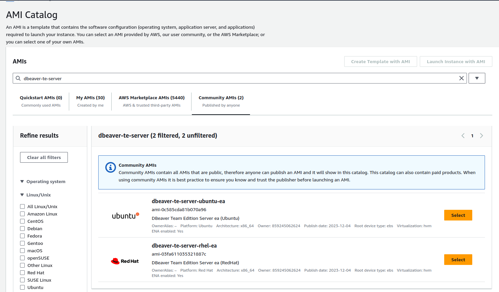

## Team Edition deployment for AWS AMI

#### Minimum requirements:

* 4 CPUs
* 16GB RAM
* 100GB Storage (SSD recommended)

### How to deploy AMI in AWS

- Go to [AWS EC2](https://console.aws.amazon.com/ec2/home) -> AMI Catalog -> Community AMIs
- Find `dbeaver-te-server`
- Choose version

- Launch instance

#### Note:
- Use recommended [Minimum requirements](#minimum-requirements) resources for the best experience with this product
- For security reasons, it is not recommended to make the service public in security group configuration

## Setup and control options

- [Team Edition server manager](../../manager/)
- [SSL certificate configuration](../../SSL/)
- [Version update procedure](../../manager/README.md#version-update-procedure)
