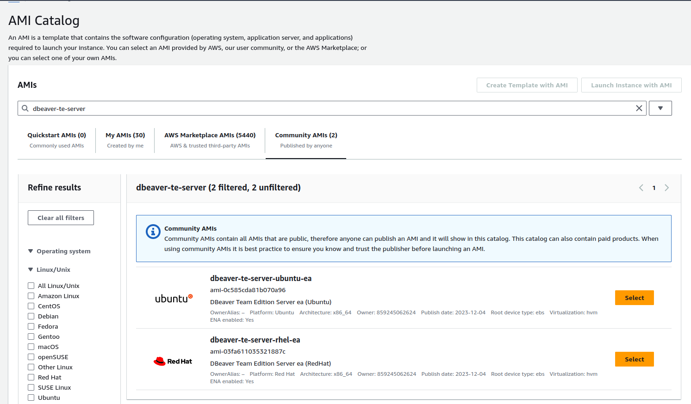

## Team Edition deployment for AWS AMI

#### Minimum requirements:

* 4 CPUs
* 16GB RAM
* 100GB Storage (SSD recommended)

### How to deploy AMI in AWS

- Go to [AWS EC2](https://us-east-1.console.aws.amazon.com/ec2/home?region=us-east-1) -> AMI Catalog -> Community AMIs
- Find `dbeaver-te-server`
- Choose version

- Launch instance

#### Note:
- Use recommended [Minimum requirements](#minimum-requirements) resources for the best experience with this product
- For security reasons, it is not recommended to make the service public in security group configuration

### How to use manager

`dbeaver-te` is a utility to manage a Team Edition server. Using this manager, you can start or stop the server, as well as update its version.

- Connect to your server through the terminal. Use SSH user as `ubuntu` if you use Ubuntu distributive, or `ec2-user` if RHEL distributive.
- Enter `dbeaver-te` or `dbeaver-te help` to see help menu

### SSL certificate configuration

#### If you want to use official certificates from CDN services

1. Get certificates for your domain from a third party service (for example [Cloudflare](https://www.cloudflare.com/learning/ssl/what-is-an-ssl-certificate/)). You need an SSL certificate file and public-private key pair.
2. Replace files in `/opt/dbeaver-team-server/team-edition-deploy/compose/cbte/nginx/ssl`
   - Certificate: `fullchain.pem`  
   - Private Key: `privkey.pem`
3. Change `CLOUDBEAVER_DOMAIN=localhost` to your domain in .env file.
4. Enter `dbeaver-te stop` and `dbeaver-te start` to accept new config.

#### If you want use Let's Encrypt self-signed certificate

1. You must use one of the following users: `ubuntu` (`sudo su - ubuntu`) or `ec2-user` (`sudo su - ec2-user`).
2. Make sure you have configured the variables correctly in `.env` file at DBeaver TE server home `/opt/dbeaver-team-server/team-edition-deploy/compose/cbte/`:
  - `CLOUDBEAVER_DOMAIN` as your domain
  - `LETSENCRYPT_CERTBOT_EMAIL` as your email to receive notifications
3. Run `dbeaver-te le`

### Version update procedure

The update occurs with the help of the [manager](#team-edition-server-manager).

1. Connect to your server through the terminal.
2. Enter `dbeaver-te update list`
3. Choose the version you want to update.
4. Run this command: `dbeaver-te update %version%`