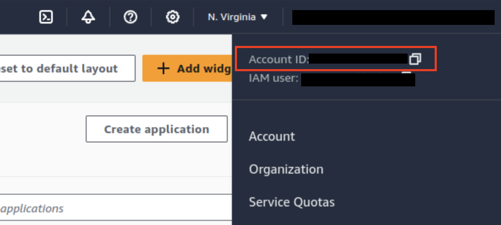
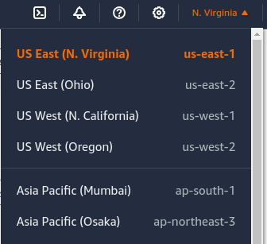
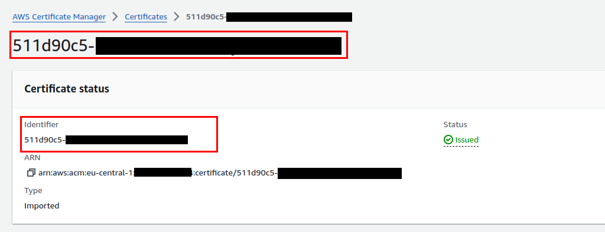

## Team Edition deployment for AWS ECS and Fargate with Terraform

1. First you need to install and configure your AWS CLI:

   - [Install AWS CLI](https://docs.aws.amazon.com/cli/v1/userguide/cli-chap-install.html)

   - [Environment variables to configure the AWS CLI](https://docs.aws.amazon.com/cli/latest/userguide/cli-configure-envvars.html)

2. Check that your AWS user has the minimum required IAM policies:

   - `AmazonECS_FullAccess`
   - `AmazonEC2FullAccess`
   - `AmazonRDSFullAccess`
   - `AWSCloudMapFullAccess`

3. Next you need to [install Terraform](https://developer.hashicorp.com/terraform/install)

4. Clone the Git repository to your local machine by running the following command in your terminal:
```
git clone https://github.com/dbeaver/cloudbeaver-deploy.git
```
5. Choose configuration for your cluster database:
   - If you plan to use the PostgreSQL internal container:
     - Navigate to `team-edition-deploy/AWS/ecs-fargate`  
     - Open `variables.tf`.
     - Update `variables.tf` file. Modify `POSTGRES_PASSWORD` field in `cloudbeaver-db-env` vatiables.

   - If you plan to use an RDS-based database:
 **Note:** only [Amazon RDS for PostgreSQL](https://aws.amazon.com/rds/postgresql/) is supported.
      - Navigate to `team-edition-deploy/AWS/ecs-fargate`  
      - Open `variables.tf` file.  
      - Change variable `rds_db` to `true`.
      - Specify `rds_db_version`, the default is `postgres:16.1`. Only PostgreSQL version can be specified.  
      - Set the credentials for database in `cloudbeaver-db-env`. By default it is `postgres`.

6. Configure the deployment in `variables.tf` file as follows:  
   - Set your `aws_account_id`, you can get it by logging into your AWS console:

   

   - Set your `aws_region` in format `us-east-1`. For example:

   

   - Ensure that the `alb_certificate_Identifier` variable contains the ID from [AWS Certificate Manager](#importing-an-ssl-certificate-in-aws) corresponding to the domain name specified   in the `CLOUDBEAVER_PUBLIC_URL` variable within `variables.tf`. The domain name in `CLOUDBEAVER_PUBLIC_URL` must match the domain for which the certificates have been issued.
   - You can customize the deployment version by updating the `dbeaver_te_version` environment variable. The default version is `25.0.0`.

7. Run `terraform init` and then `terraform apply` in `ecs-fargate` directory to create the ECS cluster and complete the deployment.

8. Cluster destruction is performed in reverse order:
    - Run `terraform destroy` in `ecs-fargate` directory to destroy ECS cluster.

## Importing an SSL Certificate in AWS

   **Note:** SSL Certificates are digital documents that ensure secure communication between a web server and a user's browser. They encrypt data to prevent interception and verify the authenticity of a website. You can obtain SSL certificates from Certificate Authorities (CAs) like Let's Encrypt, DigiCert, and Comodo.

   1. Open your web browser and log in to the AWS (Amazon Web Services) Console.  

   2. Navigate to the `AWS Certificate Manager` service.  

   3. Click on the `Import` button and fill in the necessary certificate details as prompted.  

   After completing these steps, you will receive an Identifier for your newly imported certificate.

   

## Version update

1. Navigate to the `team-edition-deploy/AWS/ecs-fargate` directory.

2. Specify the desired version in  `variables.tf` in the `dbeaver_te_version` variable.

3. Run `terraform apply` to upgrade the ECS cluster and complete the deployment.
