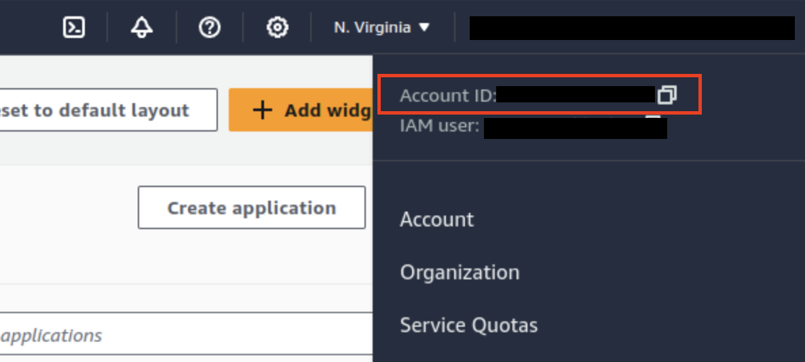
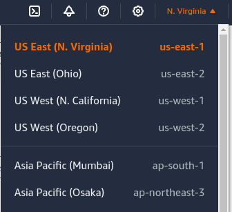

### DBeaver TE deployment for AWS ECS and Fargate with Terraform.

1. First you need to install and configure your aws-cli

 - [Install AWS CLI](https://docs.aws.amazon.com/cli/v1/userguide/cli-chap-install.html)

 - [Environment variables to configure the AWS CLI](https://docs.aws.amazon.com/cli/latest/userguide/cli-configure-envvars.html)

2. Next you need [install terraform](https://developer.hashicorp.com/terraform/install) 

3. Choose configuration for your cluster database
   - If you plane use intrnal Postgres container, update the passwords in both the `cloudbeaver-db-init.sql` file and the `variables.tf` file. Modify field `POSTGRES_PASSWORD` in varibles `cloudbeaver-db-env`
   
   - If you plane use RDS based database
      - Open `variables.tf` 
      - Change variable `rds_db` to `true`
      - Choose `rds_db_version` by default is `postgres:16.1`
      - Update the credentials for database in `cloudbeaver-db-env`

4. Configure the deployment in `variables.tf` as follows:  
   - Set your `aws_account_id`, you can get it by logging into your AWS console  

   

   - Set your `aws_region` in format `us-east-1` for example  

   
   
   - Ensure that the `alb_certificate_Identifier` variable contains the ID from AWS Certificate Manager corresponding to your domain specified in `CLOUDBEAVER_PUBLIC_URL`.
   - You can customize the deployment version by updating the `dbeaver_te_version` environment variable. The default version is `24.0.0`.

5. Run `terraform init` and then `terraform apply` in `ecs-fargate` directory to create the ECS cluster and complete the deployment.

6. Cluster destruction is performed in reverse order:
    - Run `terraform destroy` in `ecs-fargate` directory to destroy ECS cluster

### Version update

1. Navigate to the `team-edition-deploy/AWS/ecs-fargate` directory.

2. Specify the desired version in  `variables.tf` in the `dbeaver_te_version` variable.

3. Run `terraform apply` to upgrade the ECS cluster and complete the deployment.
