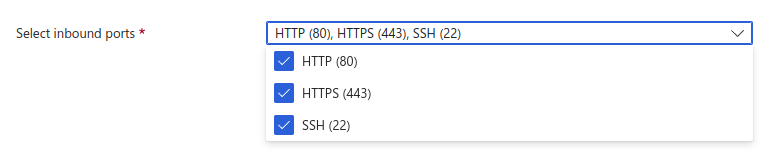

- [Deployment](#deployment)
- [Setup and control options](#setup-and-control-options)
  - [Team Edition server manager](#team-edition-server-manager)
  - [Version update procedure](version-update-procedure)

## Deployment

1. Log in to [Microsoft Azure Portal](https://portal.azure.com/) and navigate to **Azure -> Community images**.

2. Enter `dbeaver-te-server` in the search field, select location, then the version, and press **Create VM**.

3. Fill in the required fields:

- In the field **Inbound port rules** select 22, 80, and 443 ports.

- You must configure the SSH user as `ubuntu` proper server management, and enter your SSH key or specify an existing one.

- That's all done. The other fields are not required.

## Setup and control options

### Team Edition server manager

`dbeaver-te` is a utility to manage a Team Edition server. Using this manager, you can start or stop the server, as well as update its version.

How to user manager:

1. Connect to your server through the terminal.

2. Enter `dbeaver-te` or `dbeaver-te help` to see the help menu.

### SSL certificate configuration

1. Replace files in `/opt/dbeaver-team-server/team-edition-deploy/compose/cbte/nginx/ssl`
   - Certificate: `fullchain.pem`  
   - Private Key: `privkey.pem`
2. Change `CLOUDBEAVER_DOMAIN=localhost` to your domain in .env file
3. Enter `dbeaver-te stop` and `dbeaver-te start` to accept new config

### Version update procedure

The update occurs with the help of the [manager](#team-edition-server-manager).

1. Connect to your server through the terminal.
2. Enter `dbeaver-te update list`
3. Choose the version you want to update.
4. Run this command: `dbeaver-te update %version%`