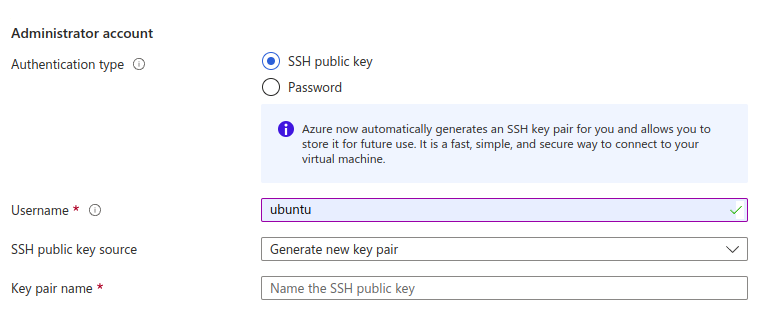

- [Deployment](#deployment)
- [Setup and control options](#setup-and-control-options)

## Deployment

1. Log in to [Microsoft Azure Portal](https://portal.azure.com/) and navigate to **Azure -> Community images**.

2. Enter `dbeaver-te-server` in the search field, select location, then the version, and press **Create VM**.

3. Fill in the required fields:

- Choose VM size with recommended resources 4 vCPUs and 16 GiB RAM

- In the field **Inbound port rules** select 22, 80, and 443 ports.

- You must configure the SSH user as `ubuntu` proper server management, and enter your SSH key or specify an existing one.

- That's all done. The other fields are not required.

## Setup and control options

- [Team Edition server manager](../../manager/)
- [SSL certificate configuration](../../SSL/)
- [Version update procedure](../../manager/README.md#version-update-procedure)
