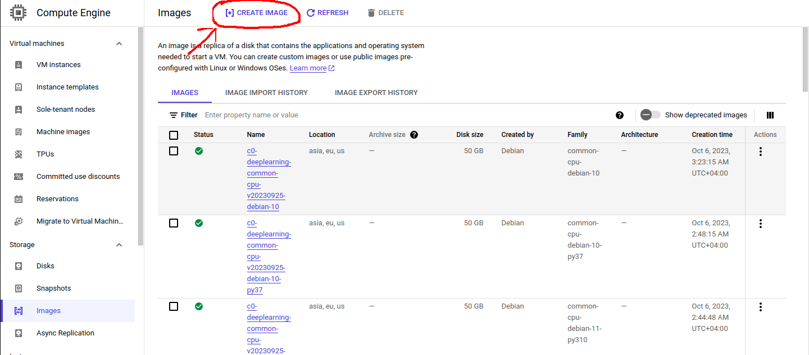

# DBeaver Team Edition deployment in Google Cloud

- [Deployment](#deployment)
  - [Deploy in Google Cloud Interface](#deployment-in-google-cloud-interface)
    - [Step 1. Import an image to your account](#step-1-import-team-edition-custom-image-on-your-gcp-account)
    - [Step 2. Create a new instance from imported image](#step-2-create-a-new-gcp-compute-engine-instance-from-the-imported-image)
  - [Deploy with Google Cloud CLI](#deployment-with-google-cloud-cli)
- [Setup and control options](#setup-and-control-options)

## Deployment

### Deployment in Google Cloud interface

To deploy Team Edition in Google Cloud Console interface, you need to import Team Edition custom image to your account using the image URI, and then create a new instance from the imported image.

#### Step 1. Import Team Edition custom image on your GCP account

1. Log in to your account in [Google Cloud Console](https://console.cloud.google.com/), navigate to **Compute Engine -> Images**, and click **[+] CREATE IMAGE**.



2. Fill in the **Create an image** form:

- In the **Name** fild write the image name in the following format: `dbeaver-te-server-ubuntu/rhel-%version%`
- In the **Source** field select **Virtual disk (VMDK, VHD)**.
- If you are prompted to enable Cloud Build tools and grant permissions, do so.
- Copy the following URI `dbeaver-te-server/dbeaver` in the **Virtual disk file** field, click **BROWSE**, and select the version you need.


That's all done. The other fields are not required.

3. Click **Create**. You may have to wait up to 15 minutes while the Team Edition server custom image imports to your account.


#### Step 2. Create a new GCP Compute Engine instance from the imported image

1. Open the tab **Images**, click on the name of the image that you just imported, and click on the **[+] Create instance** button.


2. Give your instance a name

3. In the **Machine configuration** section, make sure to pick a "Machine type" with recommended memory and cpu (4 CPUs and 16GB RAM) to run Dbeaver server.


4. In the "Boot disk" section, click the "Change" button

5. From the "Custom images" tab, select the image that you just imported in the previous steps (dbeaver-te/-ce/-ee-ubuntu/rhel-%version%) from the dropdown menu. Select a disk size of at least 100GB. When you are done, click on **Select**.


6. In the **Firewall** section, make sure to check the **Allow HTTP traffic** and **Allow HTTPS traffic** boxes so that your Dbeaver server instance can be opened from internet.

7. Finally, click the **Create** button. After a few minutes, your Team Edition server instance should be up and running.


You can check that your instance is running correctly by copying and pasting the **External IP** address provided by GCP into your browser.


## Deployment with Google Cloud CLI

1. Log in to your account in [Google Cloud Console](https://console.cloud.google.com/), navigate to **Compute Engine** and click on **Activate Cloud Shell**.


2. If you are prompted to authorize, do so.

3. In the terminal that opens, enter the following command:
```
gcloud beta compute instances create dbeaver-te-server \
--zone=us-central1-a \
--machine-type=e2-standard-4 \
--tags=http-server,https-server \
--image=https://www.googleapis.com/compute/v1/projects/dbeaver-public/global/images/dbeaver-te-server-ubuntu-24-2-0 \
--create-disk=auto-delete=yes \
--boot-disk-size=100GB --boot-disk-device-name=dbeaver-te-server
```

Where:
- `zone` - Zone of the instances to create. You can choose this from [GCP zones](https://cloud.google.com/compute/docs/regions-zones)
- `machine-type` - Specifies the machine type used for the instances. (4 CPUs and 16GB RAM resources recommended)
- `tags` - These tags allow network firewall rules and routes to be applied to specified VM instances.
- `image` - Specifies the boot image for the instances. You can choose any of our public images.
- `create-disk=auto-delete=yes` - Creates and attaches persistent disks to the instances. This persistent disk will be automatically deleted when the instance is deleted.
- `boot-disk-size` - The size of the boot disk, is 100GB recommended.
- `boot-disk-device-name` - The name the guest operating system will see for the boot disk.

DBeaver Team Edition GCP public image list:
- `https://www.googleapis.com/compute/v1/projects/dbeaver-public/global/images/dbeaver-te-server-ubuntu-24-2-0`
- `https://www.googleapis.com/compute/v1/projects/dbeaver-public/global/images/dbeaver-te-server-rhel-24-2-0`


You can change the parameters you need for deployment yourself. For detailed information on working with Google Cloud CLI, you can read the [documentation](https://cloud.google.com/sdk/gcloud/reference/beta/compute/instances/create).

## Setup and control options

- [Team Edition server manager](../../manager/)
- [SSL certificate configuration](../../SSL/)
- [Version update procedure](../../manager/README.md#version-update-procedure)
